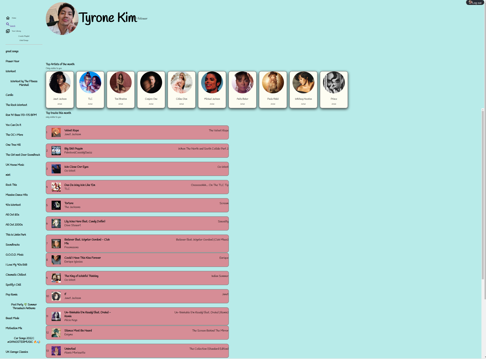
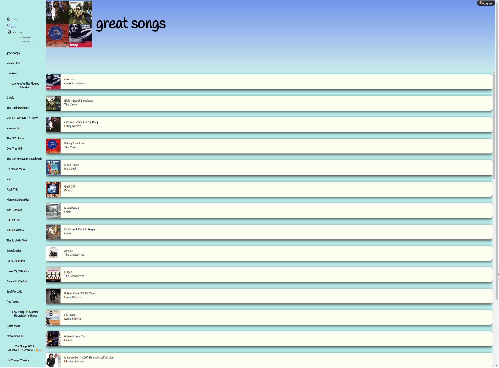

# spotify-App

in progress ...

App to allow users to view their music library and play music

This app requires a client_id and client_secret to run.

The steps can be found here https://developer.spotify.com/documentation/general/guides/authorization/app-settings/

Once you have a client_id and client_secret, create a .env file and paste 

CLIENT_ID = XXXXX
CLIENT_SECRET = XXXX

Upon logging in, user will have access to their music library and playlists. The user will also be able to search for artists.

More content to be added...

## Table of contents

- [Overview](#overview)

- [Screenshot](#screenshot)

- [Built with](#built-with)
 
- [Author](#author)

### Screenshot

#### Desktop

### Built with

- React
- Node
- Express
- Spotify API

## Author

- Linkedin - www.linkedin.com/in/tyrone-kong
